<p align="center">
  <a href="https://github.com/S4lmankhan/NeuroAssistAiModel">
    
  </a>
</p>

<h1 align="center">NeuroAssistAIModel</h1>
<p align="center">
  <strong>Advanced Brain Tumor Detection & Glioma Stage Prediction</strong><br/>
  Powered by PyTorch • Streamlit • FastAPI • Google Drive-hosted Models
</p>

<p align="center">
  <a href="https://github.com/S4lmankhan/NeuroAssistAiModel/actions/workflows/ci.yml">
    
  </a>
  <a href="LICENSE">
    
  </a>
  <a href="https://streamlit.io/cloud">
    
  </a>
  <a href="https://pypi.org/project/torch">
    
  </a>
</p>

---

## 📖 Table of Contents

1. [🚀 Overview](#🚀-overview)
2. [🎯 Features](#🎯-features)
3. [⚙️ Architecture](#⚙️-architecture)
4. [💾 Installation](#💾-installation)
5. [🌐 Usage](#🌐-usage)
6. [📂 Model Downloads](#📂-model-downloads)
7. [📦 Deployment](#📦-deployment)
8. [🛠 Troubleshooting](#🛠-troubleshooting)
9. [🤝 Contributing](#🤝-contributing)
10. [📜 License](#📜-license)
11. [✉️ Contact](#✉️-contact)

---

## 🚀 Overview

**NeuroAssistAIModel** is an end‑to‑end solution for **non‑invasive brain tumor analysis**, offering:

* **Tumor Type Detection**: Classifies MRI scans into

  * **Glioma**, **Meningioma**, **No Tumor**, or **Pituitary**
* **Glioma Stage Prediction**: Predicts glioma progression stage (I–IV) based on genetic markers

**Why NeuroAssistAI?**
Early and accurate brain tumor diagnosis can drastically improve patient outcomes. Our open‑source, browser‑based tool brings advanced AI research into your hands.

---

## 🎯 Features

* **Dual‑Model Pipeline**

  * Convolutional Neural Network for MRI classification
  * Fully Connected Network for mutation‑based staging
* **Zero‑Install Deployment**

  * Models hosted on Google Drive and auto‑download at runtime
  * Streamlit UI for instant interactive demos
* **REST API Support**

  * FastAPI endpoints for seamless integration into any frontend
* **Embeddable**

  * Expose via `<iframe>` in your website or portal

---

## ⚙️ Architecture

```mermaid
flowchart LR
    A[MRI Input] --> B[Streamlit Frontend 🧠]
    B --> C[CNN Model: TumorClassification]
    C --> D[Tumor Type Output]
    E[Genetic Data] --> F[Streamlit Frontend 🧬]
    F --> G[MLP Model: GliomaStageModel]
    G --> H[Stage Prediction]
    
    D & H --> I[User Interface / API Response]
```



* **Models** live in `models/` (`TumorModel.py`).
* **App** logic in `app.py` (Streamlit) and `newapi.py` (FastAPI).
* **Utilities** in `utils.py`.

---

## 💾 Installation

1. **Clone the repository**

   ```bash
   git clone https://github.com/S4lmankhan/NeuroAssistAiModel.git
   cd NeuroAssistAiModel
   ```

2. **Create a virtual environment**

   ```bash
   python3 -m venv .venv
   source .venv/bin/activate   # macOS/Linux
   .venv\Scripts\activate      # Windows
   ```

3. **Install dependencies**

   ```bash
   pip install --upgrade pip
   pip install -r requirements.txt
   ```

---

## 🌐 Usage

### Streamlit UI

```bash
streamlit run app.py
```

* **Tumor Detection Tab**: Upload MRI → Predict tumor type
* **Glioma Stage Tab**: Enter demographics & mutations → Predict stage

### FastAPI Endpoints

```bash
uvicorn newapi:app --host 0.0.0.0 --port 8000
```

* **GET /** → Health‑check
* **POST /predict-image** → MRI file → `{ tumor_type, next_or_precaution }`
* **POST /predict-glioma-stage** → JSON mutation data → `{ glioma_stage }`

---

## 📂 Model Downloads

Models are auto‑downloaded at first run via **gdown**. You can also download manually:

| Model                      | Google Drive Link                                                                                                                                 |
| -------------------------- | ------------------------------------------------------------------------------------------------------------------------------------------------- |
| TumorClassification (.pth) | [https://drive.google.com/file/d/1juQk4AhIi7u7I41uttCUpJYsvtsPyZUy/view](https://drive.google.com/file/d/1juQk4AhIi7u7I41uttCUpJYsvtsPyZUy/view)  |
| GliomaStageModel (.pth)    | [https://drive.google.com/file/d/19MrhHVQbSlVmaV-bP\_FIpcY5t9wjKMSX/view](https://drive.google.com/file/d/19MrhHVQbSlVmaV-bP_FIpcY5t9wjKMSX/view) |

Place them in `models/` if you prefer **offline** usage.

---

## 📦 Deployment

### Streamlit Cloud

1. Push to GitHub (`main` branch).
2. In [Streamlit Cloud](https://streamlit.io/cloud), create a **New App**.
3. Select **NeuroAssistAiModel**, branch `main`, entry `app.py`.

Your live URL will be:

```
https://<your-username>-neuroassistaimodel.streamlit.app
```

### Embedding via `<iframe>`

```html
<iframe
  src="https://<your-username>-neuroassistaimodel.streamlit.app"
  width="100%" height="800" frameborder="0">
</iframe>
```

---

## 🛠 Troubleshooting

* **Model Load Errors**:

  * Ensure your `.pth` matches the architecture in `TumorModel.py`.
  * Run with `strict=False` and inspect missing/unexpected keys in the Streamlit sidebar.

* **Drive Download Fails**:

  * Confirm **public access** on Google Drive.
  * Test `gdown` manually:

    ```bash
    pip install gdown
    gdown https://drive.google.com/uc?id=1juQk4AhIi7u7I41uttCUpJYsvtsPyZUy
    ```

* **Iframe Blocked**:

  * Check browser console for `X-Frame-Options`.
  * Use redirect or proxy if needed.

---

## 🤝 Contributing

We welcome your ideas! To contribute:

1. Fork the repo
2. Create a feature branch:

   ```bash
   git checkout -b feature/YourFeature
   ```
3. Commit your changes
4. Push and open a Pull Request

Please follow our [Code of Conduct](CODE_OF_CONDUCT.md).

---

## 📜 License

Distributed under the **MIT License**. See [LICENSE](LICENSE) for details.

---

## ✉️ Contact

Salman Khan • [@s4lmankhan](https://github.com/S4lmankhan) • [redhawk112233@gmail.com](mailto:redhawk112233@gmail.com)

<p align="center">
  Made with ❤️ by NeuroAssistAI Team
</p>
::contentReference[oaicite:0]{index=0}
